# Peoject 3 Ant 

[TOC]


## 一 ，OK系统

### 个人理解：

其实就是之前学校的头歌的测试案列，只不过更为复杂，检测更多。在这个项目里面，需要进行问题先解锁，这个地方考察对该问题的理解，回答全部问题之后，所有的问题就解锁了，可以进行代码编写和进行测试了。

### 使用：

```python
python3 ok --submit 上传自己写的代码
python3 ok --local  如果不想要把自己代码上传到网站，使用本地运行
python3 ok -q [question number] -u 去检验每一个问题是否理解
python3 ok -q [question number] -i 去检验每一个问题是否通过
```

## 二，The Game

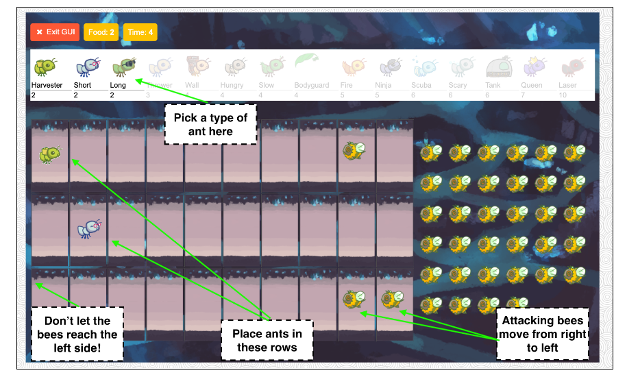

其实我们小时候都玩过一个游戏，叫植物大战僵尸，其实项目本身的灵感也来源于这个游戏。

### Core concepts

**The Colony**:整个游戏所展现的界面，包含蚂蚁这边的Places以及蜜蜂这边的The Hive两大部分。

**Places:**好几条路线（tunnel）共同组成了蚂蚁所在的位置，每一个路线，都有很多place组成。

**The Hive**：这是蜜蜂所在的位置，就是图片上的右面。

**Ants**：各种蚂蚁，有产生食物的蚂蚁，有能进行远程的蚂蚁，还有能进行保护的蚂蚁等，共同组成了蚂蚁的反抗大军。

**Bees**：其实游戏代码里面蜜蜂也有很多种类，但是在游戏里面，我只遇到过，普通的蜜蜂。

### Core classes

**`GameState`**：就是游戏基本的信息和规则，比如还有多少食物，时间多去了多少等等。

**`Place`**：这个就是单个的位置的版块，之前图上的一个个小方格。它可以包含一个蚂蚁（保护蚂蚁除外），很多个蜜蜂（用列表保存），大部分的实例都有出口和入口，除了开始和结束的只有其中之一，可以参考下面这个图。


**`Hive`**：该类继承Place，是蜜蜂的出生位置，但是不能安放蚂蚁。

**`AntHomeBase`**：这个就是游戏胜利条件之一（对于完成问题12来说），就是每一个通道最后的位置，一旦蜜蜂进入到这个位置，蜜蜂获得胜利。

**`Insect`**：该类是基本的昆虫类，包含两个子类，为Ant和Bee。有着生命值属性（health）,位置属性（place）,行为方法（action）。

生命值减少到0或者以下，该昆虫会被移除游戏。位置属性代表该昆虫位于什么地方，行为方法代表进行的行为，比如蜜蜂可以进行移动和叮咬。

**`Ant`**:代表蚂蚁。不同的蚂蚁有着特殊的属性或者特殊的行为方法。每一个蚂蚁都有着事物消耗量（food_cost）。

**`Bee`**：代表蜜蜂，每一回合蜜蜂进行移动或者进行叮咬蚂蚁（该位置有蚂蚁）。

### Game Layout（游戏布局）

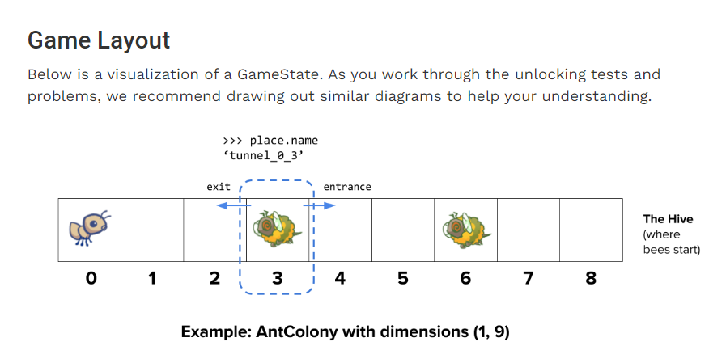

还是这个图片，蚂蚁进行生产防御，蜜蜂进行移动进攻。每一个位置有着出口和入口。

### Playing the game（玩一玩这个游戏）

```python
python3 ants_text.py   #进行文字版游戏
python3 gui.py		   #进行图形版游戏

usage: ants_text.py [-h] [-d DIFFICULTY] [-w] [--food FOOD]
Play Ants vs. SomeBees
optional arguments:
  -h, --help     show this help message and exit
  -d DIFFICULTY  (test/easy/normal/hard/extra-hard)#设置游戏的困难程度，蜜蜂的数量以及通道的数量
  -w, --water    #增加这个水这个游戏玩法
  --food FOOD    #开局的食物量
```


## 三，Phase 1: Basic gameplay

第一个部分主要是进行基础的游戏逻辑和实现两只蚂蚁，the `HarvesterAnt` and the `ThrowerAnt`.

### Problem 0 (0 pt)

#### 问题描述：

其实就是通读一遍代码，进行对游戏理解的测试，都是选择题目，看完前面的核心概念和核心类，进行代码通读，问题很简单。

其实当通读代码的时候，我对Python语言忘记很多，包括基本语法和面向对象的基本概念。进行了基本语法学习（数据类型，语法逻辑），了解面向对象的基本知识，构造。继承等等。

#### 问题分析：

pass

#### 问题解决：

pass

### Problem 1 (1 pt)

#### 问题描述：

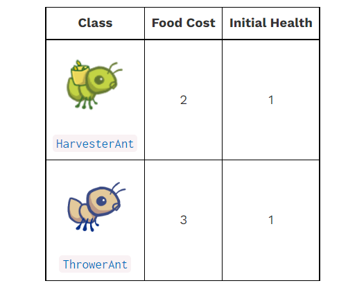

A：进行两只蚂蚁的食物消耗量的定义

B：定义HarvesterAnt的action函数，进行食物量增加

#### 问题分析：

A：作为类的属性，定义food_cost初始值即可

B：食物量(gamestate.food)为数字，每回合进行加一，就是 x += 1  

#### 问题解决：

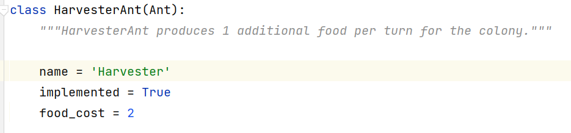

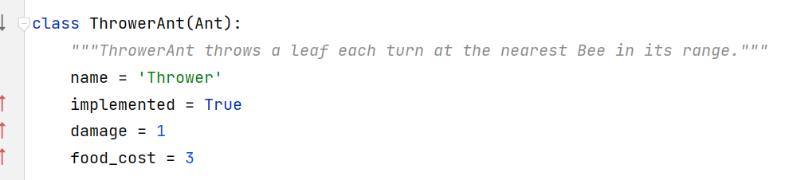

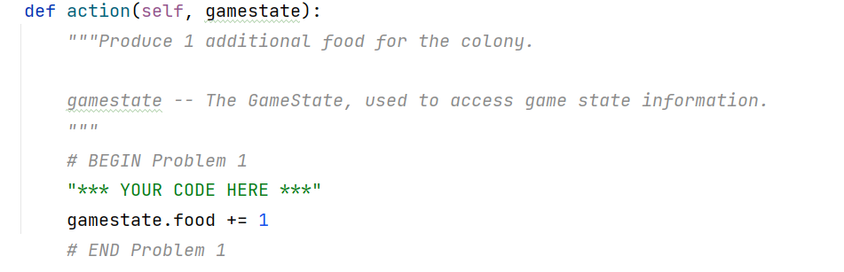

### Problem 2 (1 pt)

#### 问题描述：

该问题意思是当进行一个个Plcae构建的时候，进行出口的构建，保证一个Plcae有出口的时候一定有入口。

#### 问题分析：

##### 要求：

- A newly created `Place` always starts with its `entrance` as `None`.
- 新创建的Place总是以其入口为None开始。
- If the `Place` has an `exit`, then the `exit`'s `entrance` is set to that `Place`.
- 如果place有一个出口，然后这个出口的入口也要被设置成当前创建的place

在进行测试的时候明白了，Plcae是从左向右来创建，exit是一个Place类型的量，在创建当前Plcae的时候，所以直接把exit的entrance改成当前创建的量。

```python
exit.entrance = self
```

#### 问题解决：

因为最左边的Plcae的exit是空的，所以进行一个判断。

```python
 # BEGIN Problem 2
 "*** YOUR CODE HERE ***"
    if self.exit is not None:
      exit.entrance = self

 # END Problem 2
```

### Problem 3 (1 pt)

#### 问题描述：

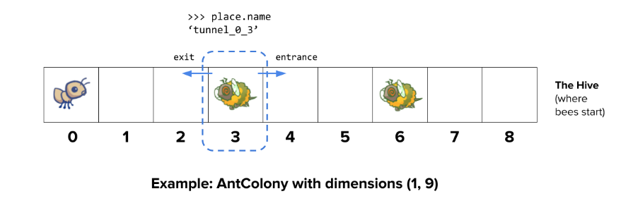

要实现ThrowerAnt中的一个方法nearest_bee，该方法是判断ThrowerAnt前面有没有敌人，如果没有，返回为空，如果有在不同的Place都有，返回最近的那个bee，如果一个Place有多个bee，随机返回一个。

#### 问题分析：


##### 要求：

- Start from the current `Place` of the `ThrowerAnt`.
- 从蚂蚁当前place开始
- For each place, return a random bee if there is any, and if not, inspect the place in front of it (stored as the current place's `entrance`).
- 对于每一个地方，如果有蚂蚁返回任意一只蚂蚁，在它前面的place(储存作为当前蚂蚁的entrance)
- If there is no bee to attack, return `None`.
- 如果没有被蜜蜂攻击，返回None

因为当前位置前面一般很多place,应当进入循环，将每一个place进行检查，判断有没有蜜蜂，如果没有，进行循环，测试下一个，直到遇到entrance不存在。

#### 问题解决：

这是一开始的解决方案，当然这个没有完全通过测试，问题大概是没有检查当前位置是否有蜜蜂，第二个是改进之后的解决方案。

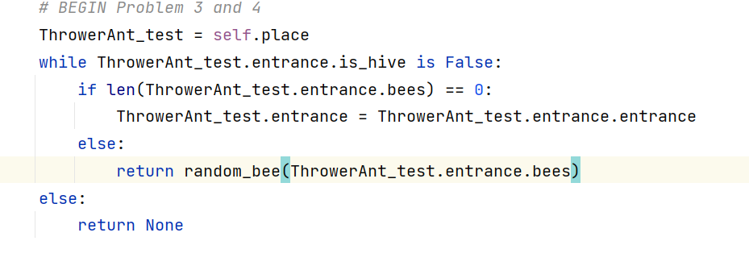

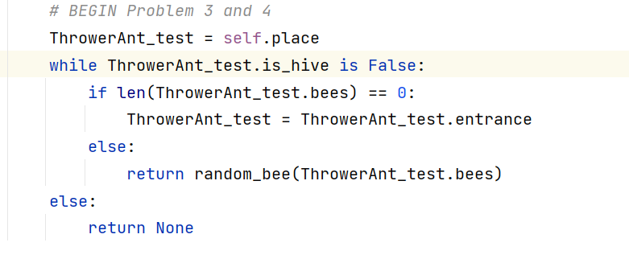

## 四，Phase 2: Ants!

完成第一阶段的游戏设置和完善两只蚂蚁之后，我们要增加更多的蚂蚁，代码里面有很多蚂蚁的框架，但是为了让它在gui.py里面显示，需要将class的implemented属性改为Ture.

游戏难度可以进行改变：

```python
python3 ants_gui.py -d easy/-d normal/-d hard/-d extra-hard
```


### Problem 4 (2 pt)

#### 问题描述：

为了降低蚂蚁的食物消耗量，将在ThrowerAnt的基础上增加两个有一些攻击限制的蚂蚁：

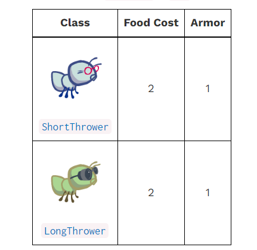

##### LongThrower：

最大攻击范围是无限大，最小攻击范围是5,，意思是可以打到5（包括5）范围以外的蚂蚁，伤害和父类一样，食物消耗量比父类的低1。

##### ShortThrower：

最大攻击范围是3，最小攻击范围是0,，意思是可以打到3（包括3）范围以外的蚂蚁，伤害和父类一样，食物消耗量比父类的低1。

要求使用两个变量min_range和max_range，表示最小攻击范围和最大攻击范围。

#### 问题分析：

其实问题分为两步：

第一步：将第三个问题的检查最近的蚂蚁进行变量添加，min_range和max_range，使得两种子类蚂蚁继承方法可以直接使用。

```python
 # BEGIN Problem3 and 4
        ThrowerAnt_test = self.place
        x = 0
        while x < self.min_range:                        #目的是让判断到达最近的攻击距离
            if ThrowerAnt_test.entrance:
                ThrowerAnt_test = ThrowerAnt_test.entrance
                x = x + 1
            else:
                return None                             #如果前面没有了位置就返回没有
        x = 0											#重新赋值
        while x <= (self.max_range - self.min_range):   #判断次数是最大范围减去最小范围
            if ThrowerAnt_test.is_hive is False:        #判断是不是蜂巢
                if len(ThrowerAnt_test.bees) == 0:      #如果这个位置没有蜜蜂就进行前移
                    ThrowerAnt_test = ThrowerAnt_test.entrance
                    x = x + 1
                else:
                    return random_bee(ThrowerAnt_test.bees) #否则就返回其中一个小蜜蜂
            else:
                return None
        else:
            return None
        # return random_bee(self.place.bees)  # REPLACE THIS LINE
        # END Problem 3 and 4
```

第二步：添加两个子类蚂蚁的一些伤害，攻击范围等参数。

#### 问题解决：

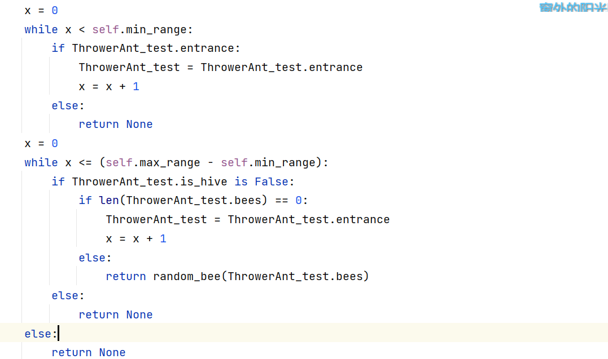

**父类投掷蚂蚁：**

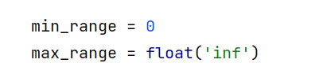

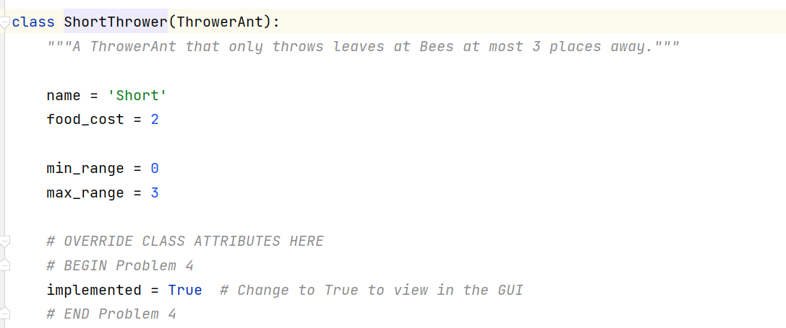

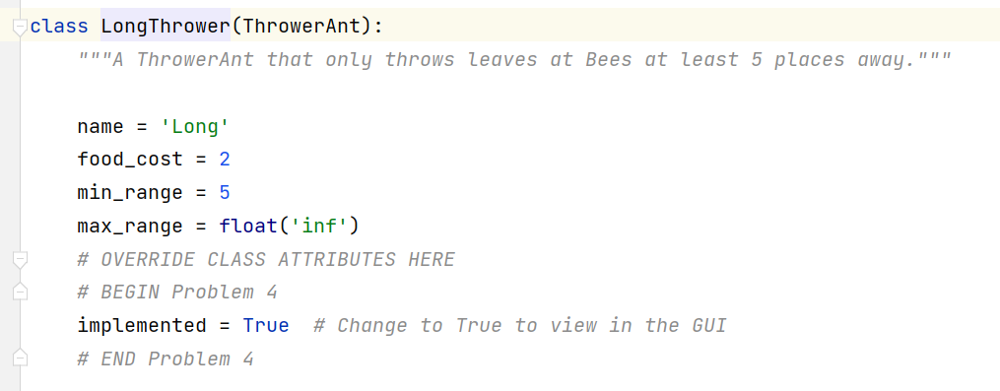


### Problem 5 (3 pt)

#### 问题描述：

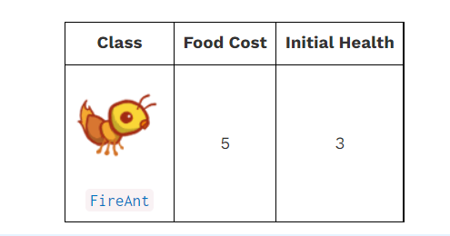

火蚁的特殊功能在于收到攻击之后会反弹所有伤害（伤害量为受到的伤害）对当前位置的蜜蜂，当自己受到伤害死亡的时候会造成一个大量伤害。

- Determine the reflective damage amount: start with the `amount` inflicted on the ant, and then add `damage` if the ant's health has dropped to 0.

  决定伤害的反弹数值，一开始是amount，如果生命值为0一下，增加伤害量damage，计算出伤害总额。

- For each bee in the place, damage them with the total amount by calling the appropriate `reduce_health` method for each bee.

  调用reduce_health方法对当前位置的所有蜜蜂造成伤害

#### 问题分析：

问题关键在于进行一个伤害量的判断，有没有大于或者等于生命值，根据结果进行伤害量的计算，得到伤害量之后，进行一个当前位置的列表遍历，对当前位置蜜蜂进行一个伤害。具体实现：

```python
 # BEGIN Problem 5
        bees_test = self.place.bees                         #将当前位置的蜜蜂传递另一个列表
        if self.health <= amount: 							#进行一个伤害量的判断
            damage_total = self.health + self.damage 		#大于等于生命就加伤害
        else:
            damage_total = amount							#小于就是当前传递的数值
        x = 0
        y = len(bees_test)                                  #进行一个蜜蜂个数判断
        while x < y:                                         
            Insect.reduce_health(bees_test[x], damage_total) #进行伤害传递
            if y > len(bees_test):                           #如果蜜蜂死了，代表y大于当前个数
                y = y - 1                          #x不变，y的数值减一，保证x不会大于列表的个数
            else:
                x = x + 1
            self.place.bees = bees_test            #将列表的参数重新赋给当前位置蜜蜂
        super().reduce_health(amount)			   #最后对自己造成伤害
        # END Problem 5
```


#### 问题解决：

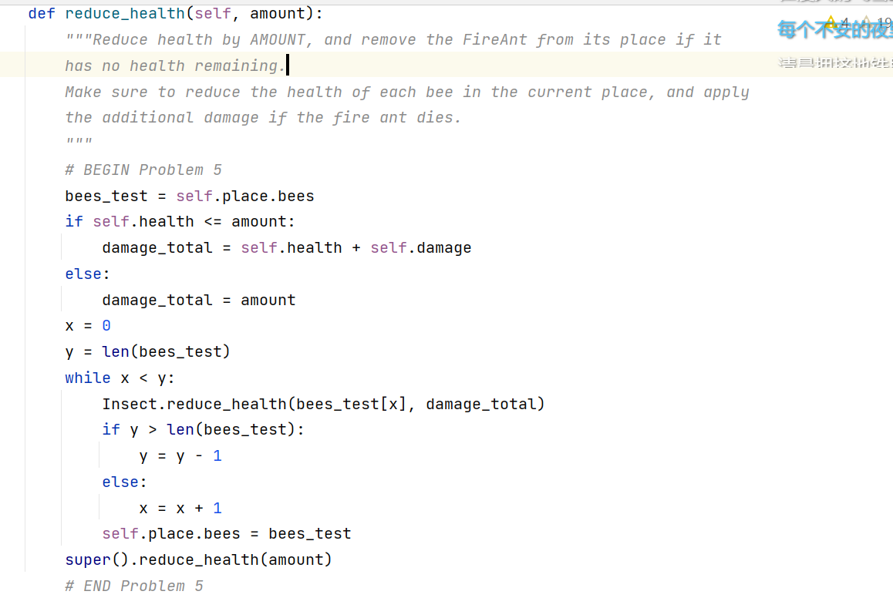

## 五，Phase 3: More Ants!

### Problem 6 (1 pt)

#### 问题描述：

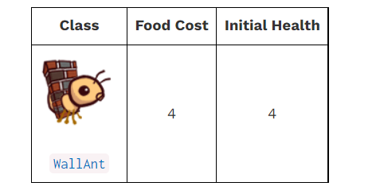

这个蚂蚁的没啥特别之处，就是生命值很高，起到一个保护作用，没啥难度。

#### 问题分析：

其实就是根据之前的蚂蚁进行一个学习，构建一下这个类。

#### 问题解决：

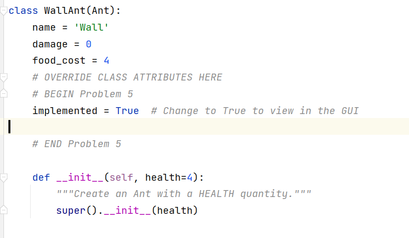

### Problem 7 (3 pt)

#### 问题描述：

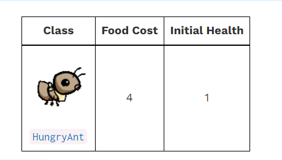

能吃蜜蜂的蚂蚁，这个蚂蚁让我想到了植物大战僵尸的大嘴花，直接生吞一只蜜蜂，但是需要一定的周期将这个蜜蜂消化，然后才能进行下一次的吃蜜蜂。

#### 问题分析：

- Implement the `action` method of the `HungryAnt`: First, check if it is chewing; if so, decrement its `chew_countdown`. Otherwise, eat a random `Bee` in its `place` by reducing the `Bee`'s health to 0. Make sure to set the `chew_countdown` when a Bee is eaten!

  实现蚂蚁的行动方法，首先需要进行判断蜜蜂是不是在咀嚼，如果是将类的一个属性量减一，如果不是，判断当前位置有没有蜜蜂，有的话，直接吃一只。

#### 问题解决：

```python
    def action(self, gamestate):
        """The action performed each turn.
        gamestate -- The GameState, used to access game state information.
        """

        if self.chew_countdown == 0:            #如果没有在咀嚼，就进行判断有没有蜜蜂，有的话就吃
            if len(self.place.bees) != 0:
                #调用父类函数，得到一直当前位置的任意蚂蚁，然后在对他造成他生命值大小的伤害
                Insect.reduce_health(random_bee(self.place.bees), (random_bee(self.place.bees)).health)
                #将在咀嚼的标志量赋值
                self.chew_countdown = self.chew_duration
        else:                                  #在咀嚼，那就将标志量减一
            self.chew_countdown -= 1
```


### Problem 8 (3 pt)

#### 问题描述：

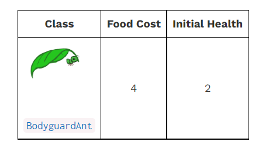

这个保护蚂蚁继承的是容器蚂蚁，在他的基础上，多了食物消耗和生命值。

**容器蚂蚁**：最大的的功能是能够放置在其他类型的蚂蚁身上，提供一定的保护，提供is_container属性来判断能不能容纳蚂蚁，提供can_contain方法来判断能不能容纳蚂蚁,store_ant方法来保存保护的蚂蚁。

关键问题是：

1，如果当前place没有蚂蚁，先放入容器蚂蚁，当前place的蚂蚁变成容器蚂蚁，再放入普通蚂蚁，这个蚂蚁会被保存起来，当前place蚂蚁不变。

2，如果当前place没有蚂蚁，先放入普通蚂蚁，当前place的蚂蚁变成普通蚂蚁，再放入容器蚂蚁，当前place的蚂蚁变成容器蚂蚁。

3，如果有了一个普通蚂蚁和一个容纳蚂蚁，或者有了一个容纳蚂蚁，就不能在放容纳蚂蚁了。

#### 问题分析：

```python
    def can_contain(self, other):
        # BEGIN Problem 8
        #判断当前位置有没有容纳蚂蚁和要放进来的蚂蚁不是容纳蚂蚁，就返回一个True，否则就是None
        if self.ant_contained is None and other.is_container is False:
            return True
        else:
            return None
        # END Problem 8
```


```python
  def store_ant(self, ant):
        # BEGIN Problem 8
        self.ant_contained = ant   #将放置来的蚂蚁保存到ant_contained变量里面
        # END Problem 8
```


```python
 def action(self, gamestate):
        # BEGIN Problem 8            
        #如果容纳蚂蚁包含蚂蚁，则执行的行动就是，它所容纳的蚂蚁的行动
        if self.ant_contained is not None:
            self.ant_contained.action(gamestate)
        # END Problem 8
```


```python
    def add_to(self, place):
        if place.ant is None:
            place.ant = self
        else:
            # BEGIN Problem 8
            #两个判断，第一个就是当前位置的蚂蚁是容器蚂蚁，一个是放置的蚂蚁是容器蚂蚁。
            if place.ant.is_container:
                #调用容器蚂蚁的判断能否容纳蚂蚁的方法没如果还可以容纳，就传去保存
                if place.ant.can_contain(self) is True:
                    place.ant.store_ant(self)
                else:
                    assert place.ant is None, 'Two ants in {0}'.format(place)
            else:
                if self.is_container:
                    #如果放置是容器蚂蚁，将当前位置蚂蚁保存一下，然后将这个plac蚂蚁改为容器蚂蚁
                    self.store_ant(place.ant)     
                    place.ant = self
                else:
                    assert place.ant is None, 'Two ants in {0}'.format(place)
            # END Problem 8
        Insect.add_to(self, place)

```

最后就是蚂蚁的实现：其实就是传一下参数和初始的生命值，就没其他的了

```python
class BodyguardAnt(ContainerAnt):
    """BodyguardAnt provides protection to other Ants."""

    name = 'Bodyguard'
    food_cost = 4
    # OVERRIDE CLASS ATTRIBUTES HERE
    # BEGIN Problem 8
    implemented = True  # Change to True to view in the GUI

    def __init__(self, health=2):
        """Create an Ant with a HEALTH quantity."""
        super().__init__(health)
    # END Problem 8
```


#### 问题解决：

1，修改的add_to方法

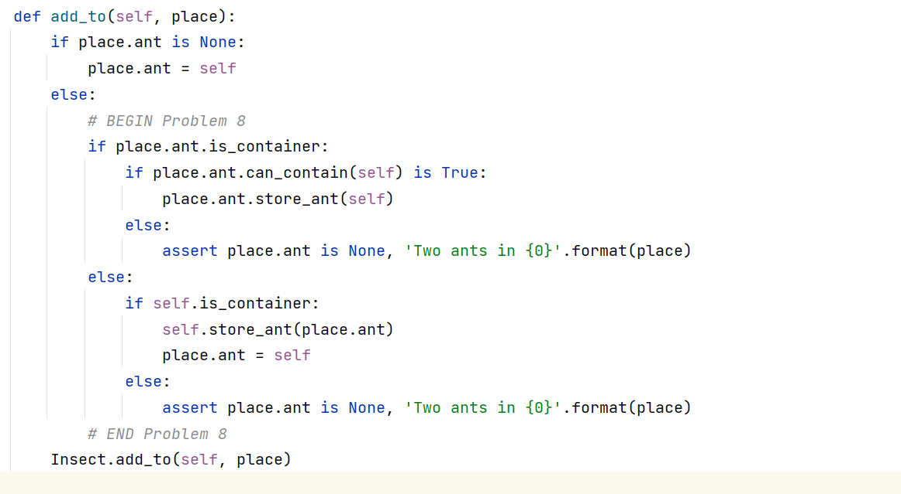

2，判断能不能容纳蚂蚁方法和保存普通蚂蚁的小方法

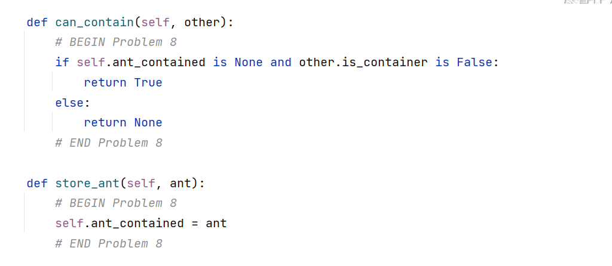

3，行动函数

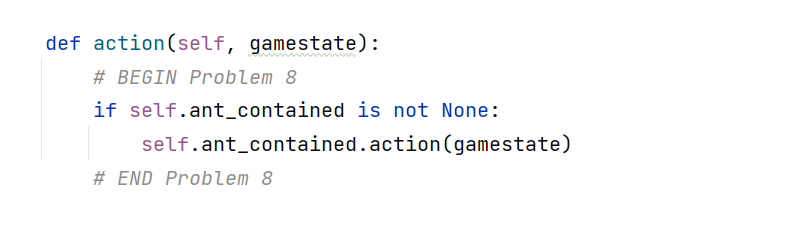

4，BodyguardAnt蚂蚁的实现

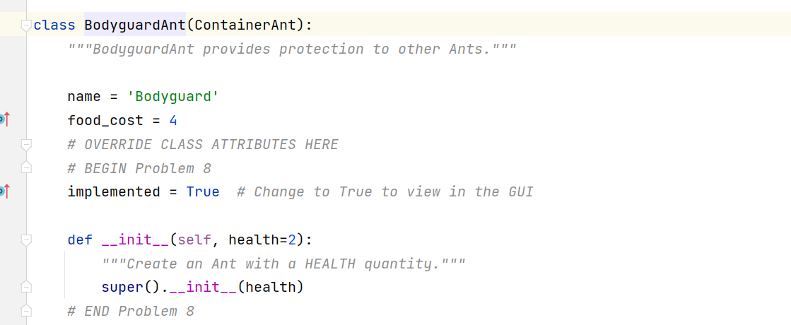

### Problem 9 (1 pt)

#### 问题描述：

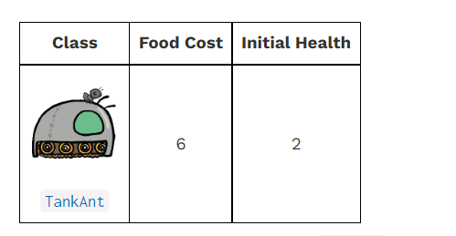

这个蚂蚁和前面的小蚂蚁不一样的地方在于，它有伤害，而且是对当前位置的所有蚂蚁每一回合造成一点伤害。

#### 问题分析：

```python
# BEGIN Problem 9
# The TankAnt class
class TankAnt(ContainerAnt):
    name = 'Tank'
    damage = 1
    food_cost = 6
    # OVERRIDE CLASS ATTRIBUTES HERE
    # BEGIN Problem 5
    implemented = True  # Change to True to view in the GUI

    # END Problem 5

    def __init__(self, health=2):
        """Create an Ant with a HEALTH quantity."""
        super().__init__(health)
'''其实这个蚂蚁的造成全部伤害在火蚁那边已经实现了，就是添加一个继承（执行包含蚂蚁的行动方法）'''
    def action(self, gamestate):
        super(TankAnt, self).action(gamestate)
        bees_test = self.place.bees
        x = 0
        y = len(bees_test)
        while x < y:
            Insect.reduce_health(bees_test[x], self.damage)
            if y > len(bees_test):
                y = y - 1
            else:
                x = x + 1
            self.place.bees = bees_test


# END Problem 9
```


#### 问题解决：

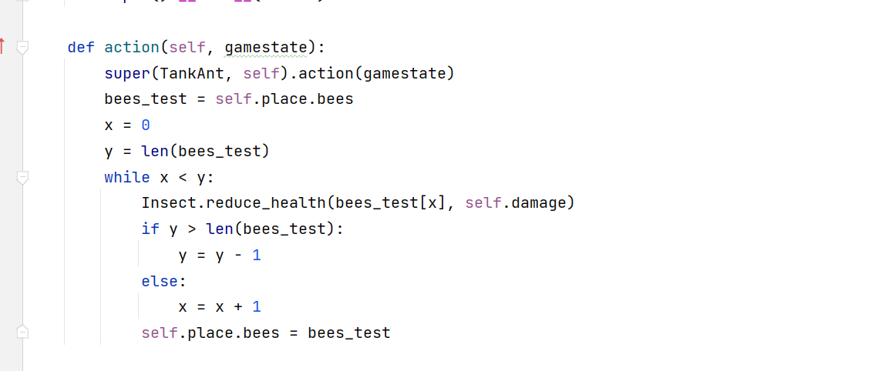

## 六，Phase 4: Water and Might

### Problem 10 (1 pt)

#### 问题描述：

本问题目的是增加一种place,这个place的作用就是只能使得能防水的昆虫能在上面，比如将要实现的ScubaThrower蚂蚁和蜜蜂（因为它能飞）

#### 问题分析：

1，设置一个is_waterproof的类属性，来进行防水的判断，如果能防水，其实和普通place一样

2，如果昆虫不能防水，那么一个回合之后，它的生命会降至0

```python
    def add_insect(self, insect):
        """Add an Insect to this place. If the insect is not waterproof, reduce
        its health to 0."""
        # BEGIN Problem 10
        #进行防水判断
        if insect.is_waterproof:
            #防水就可以把放这里，之后没有任何问题
            super().add_insect(insect)
        else:
            #也可以放这里，只是一个回合之后蚂蚁的生命就会降到0
            super().add_insect(insect)
            insect.reduce_health(insect.health)
        # END Problem 10
```


#### 问题解决：

1，在昆虫添加一个防水类属性，只需要将蜜蜂和下面问题的蚂蚁改成Ture即可

2，这是water的完善代码

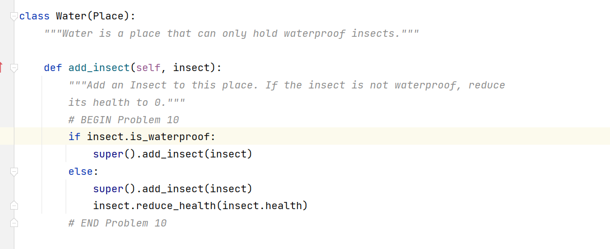

### Problem 11 (1 pt)

#### 问题描述：

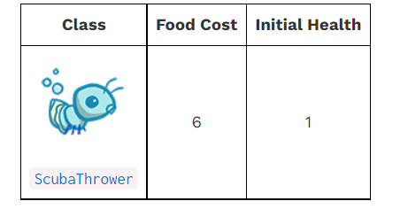

其实这个问题没有任何难度，仅仅就是按照之前的蚂蚁，继承父类投掷蚂蚁，然后修改一些属性即可。

#### 问题分析：

pass

#### 问题解决：

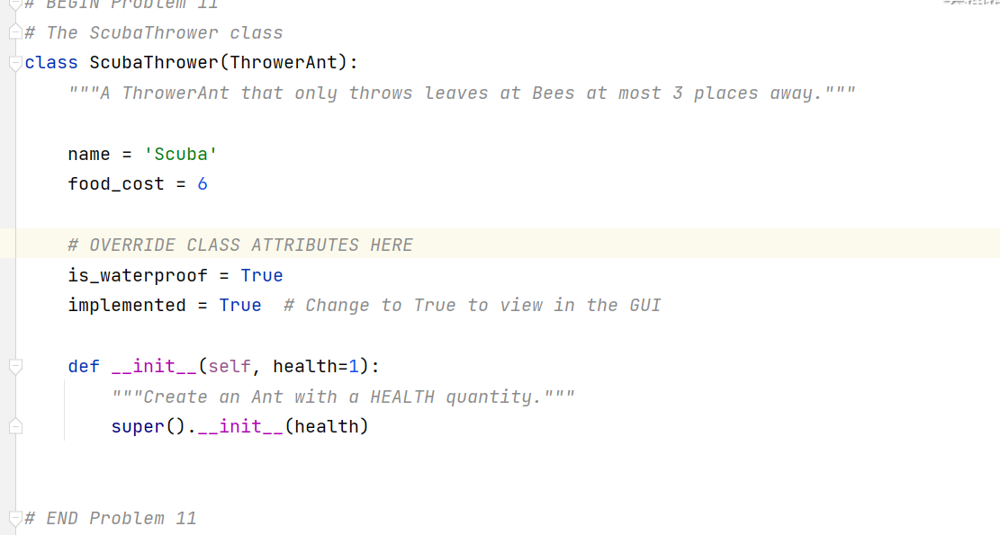

### Problem 12 (3 pt)

#### 问题描述：

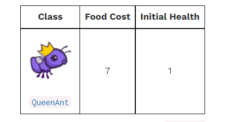

1，当蚂蚁女王生命值为0之后，游戏结束，就输掉了比赛。

2，仅仅只能创造一个蚂蚁女王，重写Ant.construct()方法。

3，蚂蚁女王不可以被移除，应当要重写Ant.remove_from方法。

4，蚂蚁女王后面的蚂蚁伤害全部加倍。

#### 问题分析：

1,当蚂蚁女王生命值为0之后，游戏结束，就输掉了比赛。

```python
 def reduce_health(self, amount):
        """Reduce health by AMOUNT, and if the QueenAnt has no health
        remaining, signal the end of the game.
        """
        #其实就是判断函数，当生命值为0或者更低的时候就调用输掉的函数
        # BEGIN Problem 12
        self.health -= amount
        if self.health <= 0:
            ants_lose()
```

2，当蚂蚁女王生命值为0之后，游戏结束，就输掉了比赛。

```python
class QueenAnt(ScubaThrower):  # You should change this line
 
    _instance = None             #增加一个类属性，来保存唯一一只女王

    @classmethod
    def construct(cls, gamestate):
 	#如果这个量没有值，代表没有创建过，那么就进行调用父类函数进行构造，如果有了那么急救返回None
        # BEGIN Problem 12        
        if not cls._instance:
            cls._instance = super(QueenAnt, cls).construct(gamestate)
            return cls._instance
        else:
            return None
        # END Problem 12
```

3，蚂蚁女王不可以被移除，应当要重写Ant.remove_from方法。

```python
def remove_from(self, place):  #我就写了一个pass，代表了没有这个移除选项
    pass
```

4，蚂蚁女王后面的蚂蚁伤害全部加倍。

首先是女王的行动方法：

```python
def action(self, gamestate):
    """A queen ant throws a leaf, but also doubles the damage of ants
    in her tunnel.
    """
    
    # BEGIN Problem 12
    super().action(self)
    ant_test = self.place
    while ant_test.exit is not None:
        ant_test = ant_test.exit
        if ant_test.ant is not None:
            if ant_test.ant.is_container:
                ContainerAnt.buff(ant_test.ant)
            else:
                Ant.buff(ant_test.ant)

    # END Problem 12
    
```


```python
def buff(self):
    """Double this ants's damage, if it has not already been buffed."""
    # BEGIN Problem 12
    if self.buff_mark:
        return None
    else:
        self.buff_mark = True
        self.damage *= 2
    # END Problem 12
```


```python
def buff(self):
    if self.buff_mark:
        pass
    else:
        self.damage *= 2
        self.buff_mark = True
    if self.ant_contained:
        if self.ant_contained.buff_mark:
            pass
        else:
            self.ant_contained.damage *= 2
            self.ant_contained.buff_mark = True
```

#### 问题解决：

