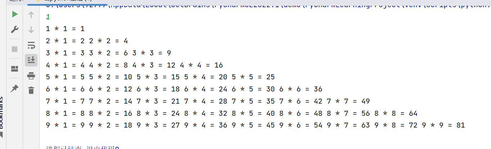
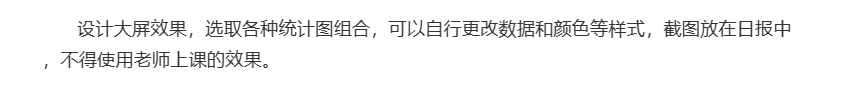
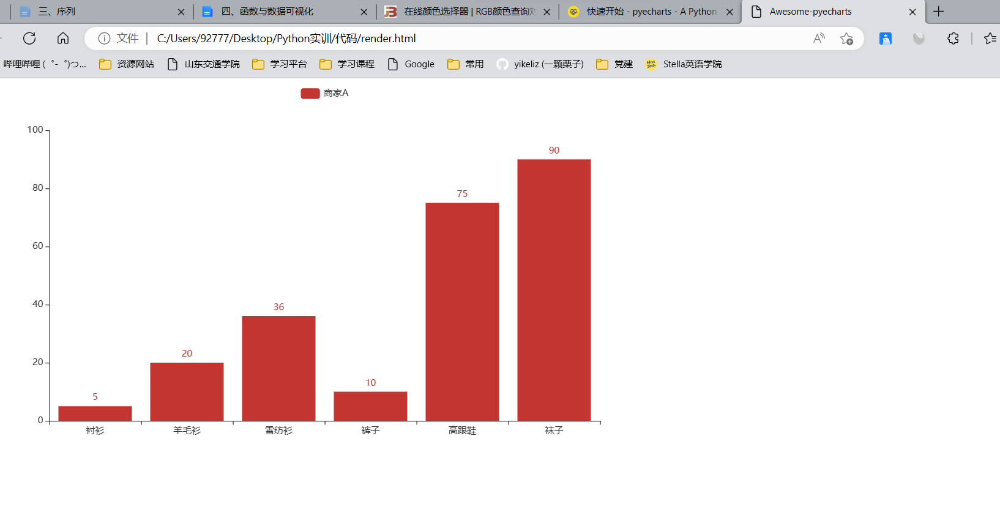
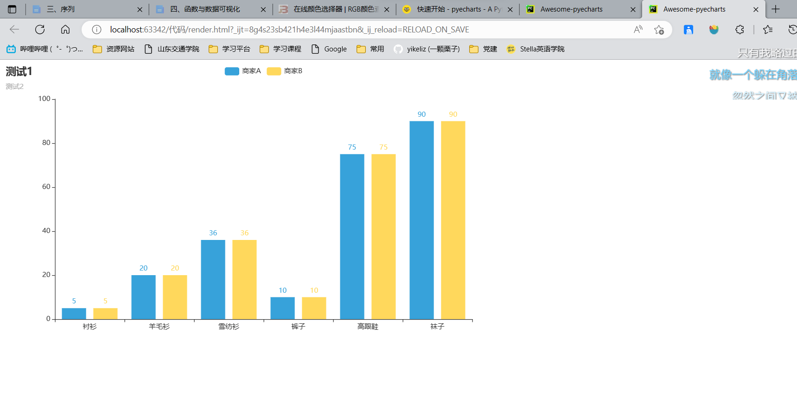

# Python实训


[TOC]

## 1，Python环境按照

pass

## 2，Python基础

### 变量（数据类型）

#### 1,数字

变量类型可以相互转换

```python
a = 1   
print(a)
a = 1.2
print(a)

1
1.2
```


#### 2,布尔类型

只有两种，True或者Flase.

```python
c = True
b = False

print(c)
print(b)

True
False
```


#### 3,字符串

##### **注意：**

python中没有字符类型

##### 代码

```python
#字符串
dateyear = '2022年'
datemouth = '12月'
dateday = '15日'
print(dateyear)
print(datemouth)
print(dateday)
print(dateyear+datemouth+dateday)

#切片
char1 = dateday[0:1]  #左闭右开
print(char1)

char1 = dateday[0:]
print(char1)
```


### 标识符（变量名称）

需要注意的就是，避免使用关键字，这里和C语言差不多，只是数量多少的差异，如return，else等等。已经被占用，执行特定的功能。


### 格式化输出

其实和C语言的printf差不多，就是最后有一点差别,没有逗号，前后都有百分号

```python
# c
int numble = 1;
printf(%d,numble);

# python
numble = 1
print('数字是%d' %numble)
```


### 键盘输入

```python
numble = int(input("请输入数字"))
print(numble)
```


### 流程控制语句

相比与C语言，Python是利用缩进来进行范围控制，而C语言是利用括号来进行范围控制。

大致有，for,if,while等流程控制。

差别比如for可以进行字符串的循环控制。

### 与或非

and,or,not

其实就像C语言的&，||，！其实没啥可说的，简单会用就行。

### day1作业

```python
number = int(input())
i = 1
while number < 10:
    while i < number + 1:
        print(number, '*', i, '=', number*i, end=' ')
        i += 1
    print()
    i = 1
    number += 1
```

效果：



## 3，序列

其实我更倾向于把这些序列归为和字符串数字一样的数据类型，大致在每一种数据类型里面掌握正删改查。

### 列表


### 元组


### 字典


### 集合


### 序列嵌套


### 总结

- **不可变数据（3 个）：**Number（数字）、String（字符串）、Tuple（元组）；

- **可变数据（3 个）：**List（列表）、Dictionary（字典）、Set（集合）。

  

## 4，函数与数据可视化

### 函数

就是进行模块化编程，和C语言的函数差不多，也没什么可说的。

### 全局变量

如果想在局部，比如函数内或者循环内使用，要是用global声明一下。

### 库

比如我们接下来要用的数据可视化就是一个库，[pyecharts](https://pyecharts.org/)，就是能实现数据可视化，将数据转化为图表。


### 数据可视化（作业）



其实可以通过阅读百度官方的文档快速上手，了解这些类的方法的作用。

```python
# 官方的示例

from pyecharts.charts import Bar

bar = Bar()
bar.add_xaxis(["衬衫", "羊毛衫", "雪纺衫", "裤子", "高跟鞋", "袜子"])
bar.add_yaxis("商家A", [5, 20, 36, 10, 75, 90])
# render 会生成本地 HTML 文件，默认会在当前目录生成 render.html 文件
# 也可以传入路径参数，如 bar.render("mycharts.html")
bar.render()

# 或者链式结构：
from pyecharts.charts import Bar

bar = (
    Bar()
    .add_xaxis(["衬衫", "羊毛衫", "雪纺衫", "裤子", "高跟鞋", "袜子"])
    .add_yaxis("商家A", [5, 20, 36, 10, 75, 90])
)
bar.render()

```


效果：



再增加一个数据，使用一下主题。

```python
#将bar设置为一个Bar类型的类
bar = Bar(init_opts=opts.InitOpts(theme=ThemeType.LIGHT))

# x与y的变量和数据
bar.add_xaxis(["衬衫", "羊毛衫", "雪纺衫", "裤子", "高跟鞋", "袜子"])
bar.add_yaxis("商家A", [5, 20, 36, 10, 75, 90])
bar.add_yaxis("商家B", [5, 20, 36, 10, 75, 90])
# 主副标题
bar.set_global_opts(title_opts=opts.TitleOpts(title="测试1", subtitle="测试2"))
bar.render()
```


效果：




## 5，数据采集（应用）


## 6，人脸识别


## 7，图形用户界面

