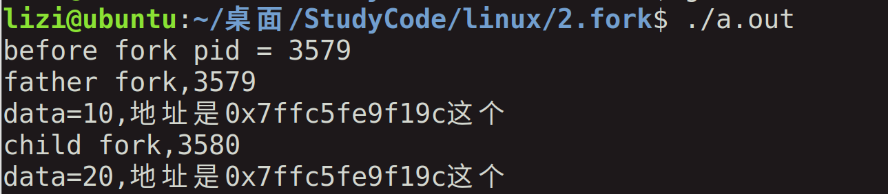
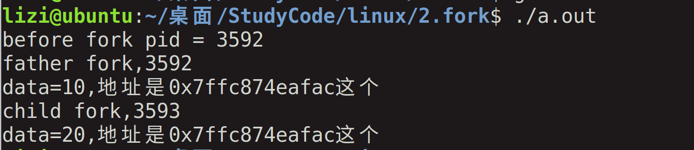
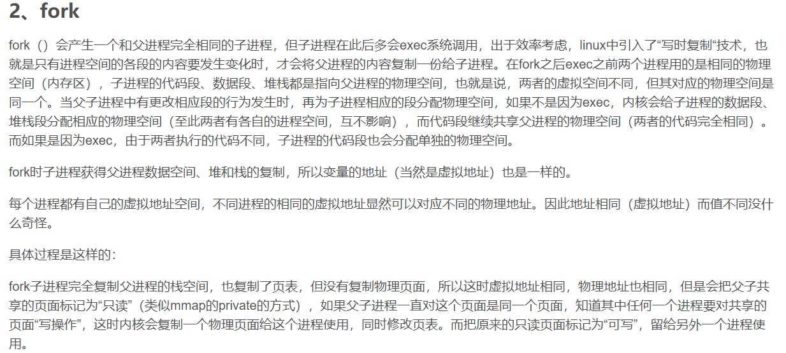
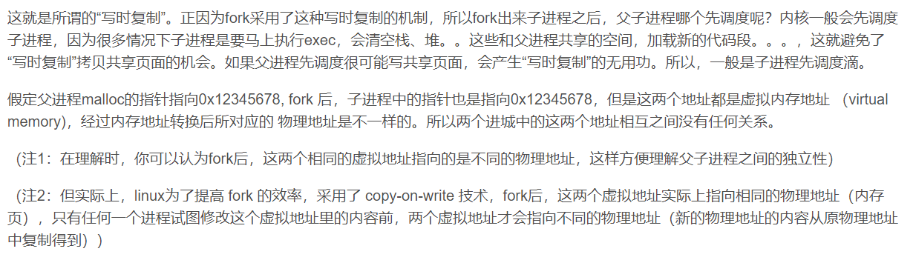
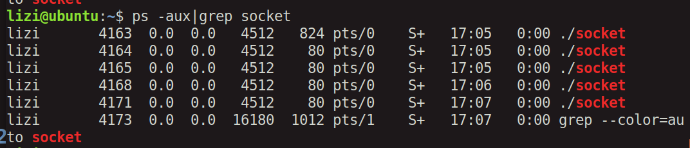
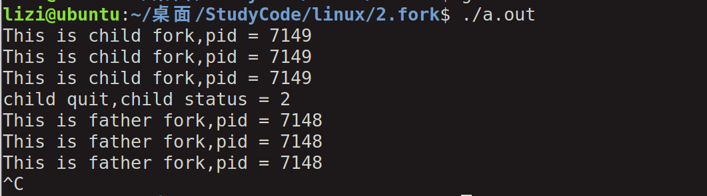
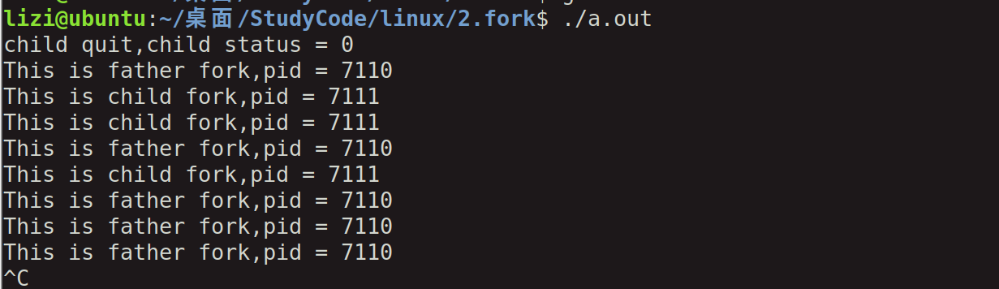
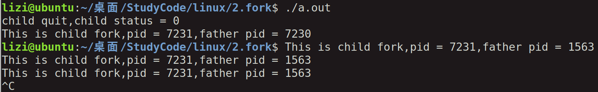
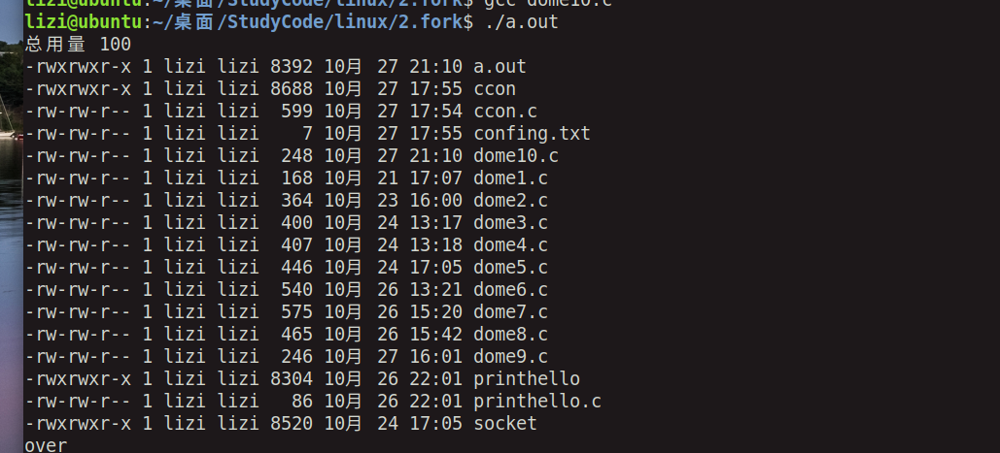
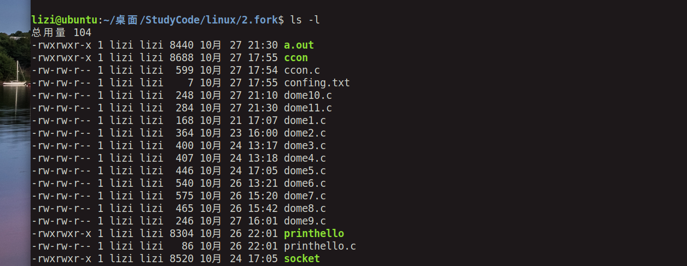

# 进程

[TOC]


## 1，进程相关概念


### ps指令：


### 全部的线程：ps -aux 

这个太多了

### 得到含有名字的：ps -aux|grep 名字


### top指令：调用任务管理器


### pid:

getpid()得到自己的进程标识符

getppid()得到父进程的标识符

```c
#include <sys/types.h>
  2 #include <unistd.h>
  3 #include <stdio.h>
  4 int main()
  5 {
  6         pid_t pida = 0;
  7 
  8         pida = getpid();
  9 
 10         printf("pid = %d\n",pida);
 11 
 12         while(1);
 13 
 14         return 0;
 15 }
 16 
```


### C语言的代码程序内存地址分布：

代码段--数据段--bss段-堆和栈


## 2,创建进程函数fork的使用

### fork函数使用：创建一个进程

其实进程创建就是相当于把之前的代码拷贝一下，然后分开执行。

拷贝之前的linux和现在的不一样，之前是全部拷贝，现在的是进行写时拷贝，子进程需要修改某个变量的时候才进行拷贝，不需要修改就是共享变量。

返回值：

执行的循序是根据进程的调度。

#### 代码：

本代码是去了解进程的作用

```c
#include <sys/types.h>
#include <unistd.h>
#include <stdio.h>
int main()
{
	pid_t pida = 0;
	pid_t pidb = 0;

	pida = getpid();
	printf("before fork pid = %d\n",pida);

	pidb = fork();

	printf("after fork pid = %d\n",getpid());

	if(pidb > 0)
	{
		printf("father fork,%d\n",getpid());
	}
	else{

		printf("child fork,%d\n",getpid());
    }
	return 0;
}

```

#### 输出：


#### 代码

两个变量，不同进程的值是不一样的，这也解释了子进程进行了拷贝，然后修改。

```c
#include <sys/types.h>
#include <unistd.h>
#include <stdio.h>
int main()
{
	pid_t pida = 0;
	pid_t pidb = 0;
 	int data = 10;
	int *p = NULL;


	pida = getpid();
	printf("before fork pid = %d\n",pida);

	pidb = fork();

	if(pidb > 0)
	{
		printf("father fork,%d\n",getpid());
	}
	else{

		printf("child fork,%d\n",getpid());
		data += 10;
        }
	
 	p = &data;
	printf("data=%d,地址是%p这个\n",data,p);
	return 0;
}
```


#### 结果：


##### 问题是：

新的进程不是去拷贝data这个变量，然后进行修改，如果这样也的话，地址应该不一样吧，另外就是如果地址一样，那么相同地址的值不应该一样嘛，还是说这个要看进程。

##### 解决/答案：

根据答疑前辈的反馈，我进行了代码修改，直接取地址。

```c
#include <sys/types.h>
#include <unistd.h>
#include <stdio.h>
int main()
{
	pid_t pida = 0;
	pid_t pidb = 0;
 	int data = 10;


	pida = getpid();
	printf("before fork pid = %d\n",pida);

	pidb = fork();

	if(pidb > 0)
	{
		printf("father fork,%d\n",getpid());
	}
	else{
		printf("child fork,%d\n",getpid());
		data += 10;
        }
	
	printf("data=%d,地址是%p这个\n",data,&data);
	return 0;
}

```

##### 结果：




##### 验证：

然后我就加以验证，是不是说初始化的一样，未初始化的会不会地址不一样呢？

```c
#include <sys/types.h>
#include <unistd.h>
#include <stdio.h>
int main()
{
	pid_t pida = 0;
	pid_t pidb = 0;
 	int data;


	pida = getpid();
	printf("before fork pid = %d\n",pida);

	pidb = fork();

	if(pidb > 0)
	{
		printf("father fork,%d\n",getpid());
		data = 10;
	}
	else{

		printf("child fork,%d\n",getpid());
		data = 20;
        }
	
	printf("data=%d,地址是%p这个\n",data,&data);
	return 0;
}

```


##### 结果：




所以可得出其实新的进程是不是不会复制变量创建新的地址。最后的问题还是说，为啥地址一样，值还不一样？

##### 答案：

其实创建的地址都是虚拟地址，那么虚拟地址的地址一样也很正常，保证所有的东西和之前一样。






## 3，进程创建的目的和实际场景

### 1，socket服务器，在收到服务请求，创建子进程对接

#### 简单的代码：

就是两个while循环，检测输入的数据和预设的数据是否相同，如果相同，那么创建线程，如果不同，什么事情都不做

```c
#include <sys/types.h>
#include <unistd.h>
#include <stdio.h>
int main()
{
	pid_t pida = 0;
	int data = 0;

	while(1){		
		printf("please input your data\n");
		scanf("%d",&data);
		if(data == 1)
		{
			pida = fork();
			if(pida >0 )
			{
			}
			else if(pida == 0){
				while(1)
				{
					printf("witing child data,pid is %d\n",getpid());
					sleep(3);
				}
			}
		}
		else{
			printf("witing father data\n");
        	}

	}
	return 0;
}

```

#### 输出：




### 2，一个进程要执行一个不同的程序（exec）

子进程从fork返回后立即调用exec(之后说明)


## 4,vfork创建线程

### 1，与fork区别

1）直接利用父进程存储空间，不拷贝

2）保证子进程先运行，当子进程调用exit()退出之后父进程在执行


这个代码明天补上


### 2，进程退出

#### 正常退出

1）main函数调用return

2 ）进程调用exit(),标准c库

3）进程调用_exit()或者__Exit(),属于系统调用

最后一个线程返回

最后一个进程掉头pthread_exit


#### 异常退出

1）调用abort

2）当进程接收到某些信号，如ctrl+c

3）最后一个线程对取消，请求做出响应


#### 相同点：


#### 建议：

就是新的进程创建之后，那么一定要进行正常退出，使用exit()函数


## 5，父进程等待子进程退出

### 1，为什么要等待退出？

创建子进程目的是为了更好的做工作，如果子进程结束，可能是正常也可能是异常结束，那么父进程为了等待子进程的结束信息，来判断工作做的如何。

### 2，函数：

#### 1，wait()函数使用

```c

```


##### 代码：

```c
#include <sys/types.h>
#include <unistd.h>
#include <stdio.h>
#include <stdlib.h>
#include <sys/wait.h>

int main()
{
	pid_t pida = 0;
	int data = 0;
	int status = 10;
	pida = fork();

	if(pida >0 )
	{
		wait(&status);
		printf("child quit,child status = %d\n",WEXITSTATUS(status));
		while(1){
			printf("This is father fork,pid = %d\n",getpid());	
			sleep(1);
		}
	}
	else if(pida == 0){
		while(1){
			printf("This is child fork,pid = %d\n",getpid());
			sleep(1);
			data++;
			if(data == 3){	
				exit(2);
			}
		}
	}
	
	return 0;
}

```


##### 运行结果：




#### 2，waitpid()函数使用


```c
#include <sys/types.h>
#include <unistd.h>
#include <stdio.h>
#include <stdlib.h>
#include <sys/wait.h>

int main()
{
	pid_t pida = 0;
	int data = 0;
	int status = 10;
	pida = fork();

	if(pida >0 )
	{
	//	wait(&status);
		waitpid(pida,&status,WNOHANG);
		printf("child quit,child status = %d\n",WEXITSTATUS(status));
		while(1){
			printf("This is father fork,pid = %d\n",getpid());	
			sleep(1);
		}
	}
	else if(pida == 0){
		while(1){
			printf("This is child fork,pid = %d\n",getpid());
			sleep(1);
			data++;
			if(data == 3){	
				exit(2);
			}
		}
	}
	
	return 0;
}

```


##### 运行结果：




### 3，孤儿进程

#### 定义：

父进程如果不等待子进程退出，在子进程之前就结束了自己的生命，此时子进程叫做孤儿进程。


linux避免系统存在过多孤儿进程，init进程收留孤儿进程，编程孤儿进程的父进程。可以用getppid（）函数来验证。


#### 代码：

```c

#include <sys/types.h>
#include <unistd.h>
#include <stdio.h>
#include <stdlib.h>
#include <sys/wait.h>

int main()
{
	pid_t pida = 0;
	int data = 0;
	int status = 10;
	pida = fork();

	if(pida >0 )
	{
		printf("child quit,child status = %d\n",WEXITSTATUS(status));
	}
	else if(pida == 0){
		while(1){
			printf("This is child fork,pid = %d,father pid = %d\n",getpid(),getppid());
			sleep(1);
			data++;
			if(data == 4){	
				exit(2);
			}
		}
	}
	return 0;
}
```


#### 运行结果：




### 6，exec族函数

#### 博客：

[exec函数详解_PCONST的博客-CSDN博客_exec函数](https://blog.csdn.net/m0_50620305/article/details/117333890)


```
用于判断这些指令所在的位置

whereis ls

whereis date
```

```c
perror("why");    打印为什么出了错误
```


```c
  1 #include <unistd.h>
  2 #include <stdio.h>
  3 
  4 
  5 
  6 //execl(const char *path, const char *arg, ...
  7 
  8 int main(void)
  9 {
 10 
 11         if(execl("./printhello","printhello",NULL, NULL)==-1)
 12         {
 13                 printf("error\n");
 14                 perror("why");
 15 
 16         }
 17         else{
 18                 printf("over\n");
 19         }
 20 
 21 
 22 
 23 
 24         return 0;
 25 }

```

linux环境变量


应用：

用子进程处理修改文件的小任务

```c
#include <stdio.h>
#include <sys/types.h>
#include <unistd.h>
#include <string.h>
#include <stdlib.h>
#include <sys/types.h>
#include <sys/stat.h>
#include <fcntl.h>
#include <unistd.h>
#include <sys/wait.h>

int main(void)
{
	
	int a;
	pid_t pid;

	while(1)
	{
		printf("please input data\n");
		scanf("%d",&a);
		if(a == 1)
		{	
			
			pid = fork();
			if(pid > 0)
			{
				wait(NULL);
			
			}

			else if(pid == 0)
			{
				execl("./ccon", "ccon", "confing.txt", NULL);
			}
		
		}
	
	}

	return 0;
}
```


```c
#include <stdio.h>
#include <sys/stat.h>
#include <fcntl.h>
#include <unistd.h>
#include <sys/types.h>
#include <stdlib.h>
#include <string.h>

int main(int argc,char **argv)
{

	char *readbuf = NULL;

	int fp = open(argv[1],O_RDWR);
	printf("fp = %d\n",fp);

	int bufsize = lseek(fp,0,SEEK_END);	
	lseek(fp,0,SEEK_SET);

	readbuf = (char *)malloc(sizeof(char)*bufsize + 8);

	read(fp,readbuf,bufsize);
				
	char *p = strstr(readbuf,"LONG=");

	p += strlen("LONG=");
	*p = '5';

	lseek(fp,0,SEEK_SET);
	write(fp,readbuf,strlen(readbuf));
				
	printf("work finsh\n");
	close(fp);

	return 0;
}
			
```


### 7，system函数

博客：


封装之后的execl函数，执行完之后，接着原函数执行。

### 代码：

```c
#include <unistd.h>
#include <stdio.h>
#include <stdlib.h>


//execl(const char *path, const char *arg, ...

int main(void)
{
	
	if(system("ls -l")==-1)
	{
		printf("error\n");
		perror("why");

	}
	else{
		printf("over\n");
	}
	return 0;
}

```


### 运行结果：




### 8，popen函数

可以获取运行结果,保存到数组里面，打印出来。


### 代码：

```c
#include <unistd.h>
#include <stdio.h>
#include <stdlib.h>


//execl(const char *path, const char *arg, ...

int main(void)
{
	FILE *fp;
	char ret[1024]={0};

	fp = popen("ls -l","r");
		
	int nread = fread(ret,1,1024,fp);

	printf("read %d byte\n %s\n",nread,ret);


	return 0;
}

```


### 运行结果：


