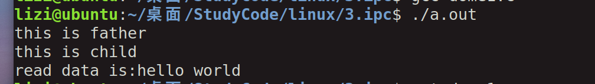
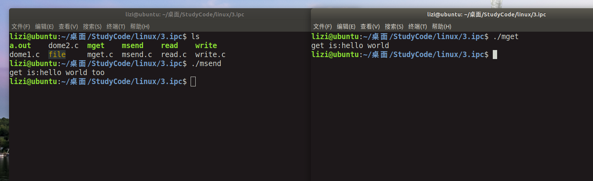
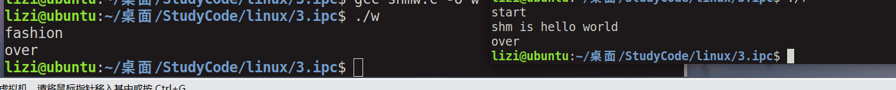
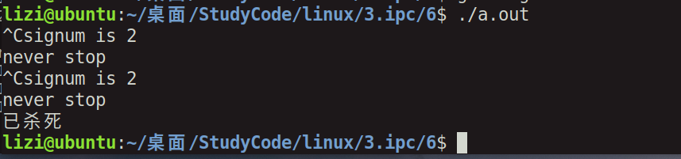
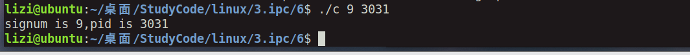
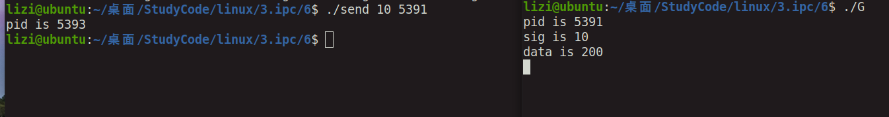
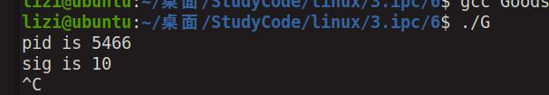
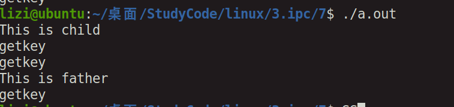

# 进程间通信

[TOC]


## 1，进程间通信概述（IPC）

### 概述：

其实就是进程运行的时候，怎么进行父进程与子进程直接的通信，在之前学的wait和exexl那种意义上的通信不太一样。

### 大概分类：

管道（无名管道和命名管道），消息队列，信号量，共享存储，socket，streams等。

其中，socket和streams支持不同主机上的进程IPC。


[一文搞懂六大进程通信机制原理(全网最详细) - 知乎 (zhihu.com)](https://zhuanlan.zhihu.com/p/465574868)


## 2，管道


### 特点：

1,半双工，就是说，只能一端读数据，一遍写数据，不能一端读和写。

2，有亲缘关系的进程之间

3，存在内存里面，可以用read write,但是不是普通文件，数据读取走了，就没了。


### 编程实战：

这个程序就是说开设一个管道，开设一个进程，父进程进行写，子进程进行读，并将结果打印出来。


#### 代码：

```c
#include <stdio.h>
#include <sys/types.h>
#include <unistd.h>
#include <unistd.h>
#include <string.h>

int main()
{
	int fd[2];
	pid_t pid;
	char buf[128];
//      int pipe(int pipefd[2]);
	
	if(pipe(fd)<0){
		printf("creat pipe failed\n");
	}
	
	pid = fork();
	if(pid < 0){
		printf("creat fork failed\n");
	}
	else if(pid > 0)
	{	
		printf("this is father\n");
		close(fd[0]);
		write(fd[1],"hello world",128);

	}
	else{
		printf("this is child\n");
		close(fd[1]);
		read(fd[0],buf,128);
		printf("read data is:%s\n",buf);
	}

	return 0;
}

```


#### 运行：




## 3，FIFO（命名管道）


### 特点：

1，可以存在两个陌生进程之间

2，产生在文件系统里面

3，还是半双工


### 代码：

mkfifo函数

read.c文件

```c
#include <stdio.h>
#include <sys/types.h>
#include <sys/stat.h>
#include <errno.h>
#include <fcntl.h>
#include <unistd.h>
#include <string.h>

//int mkfifo(const char *pathname, mode_t mode);

int main()
{
	char buf[128] = {0};
	int cet = 0;
	int nread;
	if(mkfifo("./file",0600) == -1 && errno != EEXIST)
	{
		printf("mkfifo failed\n");
		perror("why");
		
	}
	
	int fd = open("./file",O_RDONLY);
	while(cet<3){
		cet++;
		sleep(2);
		nread += read(fd,buf,30);
	}
	printf("read %d byte,conent is %s \n",nread,buf);
	
	printf("read succesed\n");
	
	close(fd);
	return 0;
}
```


write.c文件

```c
#include <stdio.h>
#include <sys/types.h>
#include <sys/stat.h>
#include <errno.h>
#include <string.h>
#include <unistd.h>
#include <fcntl.h>

//int mkfifo(const char *pathname, mode_t mode);

int main()
{	
	char *str = "hello world";
	int cet = 0;
	int nwrite = 0;
	int fd = open("./file",O_WRONLY);
	while(cet<3){
		sleep(1);
		cet++;
		nwrite += write(fd,str,strlen(str));
		
	}
	printf("write %d byte\n",nwrite);
	printf("write succesed\n");

	close(fd);

	return 0;
}

```


运行：


对比strlen和sizeof两个函数


## 4，消息队列

### 博客：

[(221条消息) 消息队列（定义、结构、如何创建、消息队列的发送与接收、发送与接收实例）_咋么又饿了的博客-CSDN博客_消息队列](https://blog.csdn.net/scarificed/article/details/121475146?ops_request_misc=&request_id=&biz_id=102&utm_term=消息队列&utm_medium=distribute.pc_search_result.none-task-blog-2~all~sobaiduweb~default-3-121475146.nonecase&spm=1018.2226.3001.4187)

### 原理：

消息队列

链表

内核


API：

 

### 代码：

先发送后接收函数msend.c

```c
#include <sys/types.h>
#include <sys/ipc.h>
#include <sys/msg.h>
#include <string.h>
#include <stdio.h>
//int msgget(key_t key, int msgflg);
//int msgsnd(int msqid, const void *msgp, size_t msgsz, int msgflg);


struct msgbuf {
         long mtype;       /* message type, must be > 0 */
         char mtext[128];    /* message data */
           };


int main()
{
	struct msgbuf sebuf = {888,"hello world"};
	struct msgbuf getbuf; 
	key_t key = ftok(".", 2);	
	int msID = msgget(key ,IPC_CREAT|0777);
	
	if(msID == -1){
		printf("megget creat failed\n");
	}

	msgsnd(msID, &sebuf, strlen(sebuf.mtext), 0);


	msgrcv(msID, &getbuf, sizeof(getbuf.mtext), 988, 0);
	printf("get is:%s\n",getbuf.mtext);

	msgctl(msID, IPC_RMID,NULL);   
	return 0;
}
```


先接受后发送函数mget.c

```c
#include <sys/types.h>
#include <sys/ipc.h>
#include <sys/msg.h>
#include <string.h>
#include <stdio.h>
//int msgget(key_t key, int msgflg);
//int msgsnd(int msqid, const void *msgp, size_t msgsz, int msgflg);
//ssize_t msgrcv(int msqid, void *msgp, size_t msgsz, long msgtyp, int msgflg);


struct msgbuf {
         long mtype;       /* message type, must be > 0 */
         char mtext[128];    /* message data */
};


int main()
{
	struct msgbuf getbuf; 
	struct msgbuf sebuf = {988,"hello world too"};
	key_t key = ftok(".", 2);
	int msID = msgget(key ,IPC_CREAT|0777);

	if(msID == -1){
		printf("megget creat failed\n");
	}
 
	msgrcv(msID, &getbuf, sizeof(getbuf.mtext), 888, 0);

	printf("get is:%s\n",getbuf.mtext);

	msgsnd(msID, &sebuf, strlen(sebuf.mtext), 0);
	
	msgctl(msID, IPC_RMID,NULL);
	return 0;
}
```


#### 运行结果：





## 5，共享内存

### linux指令

ipcs -m 来获取系统的共享内存

ipcrm -m shmid 删除共享内存


### API

```c
//创建
#include<sys/ipc.h>
#include<sys/shm.h>
int shmget(key_t key, size_t size, int shmflg);

//关联
#include<sys/types.h>
#include<sys/shm.h>
void *shmat(int shmid, const void *shmaddr, int shmflg);

//去关联
#include<sys/types.h>
#include<sys/shm.h>
int shmdt(const void *shmaddr);

//设置
#include<sys/types.h>
#include<sys/shm.h>  
int shmctl(int shmid, int cmd, struct shmid_ds *buf);  //cmd:IPC_RMID是删除
```


### 代码：

#### 发送

```c
#include <stdio.h>
#include <sys/ipc.h>
#include <sys/types.h>
#include <sys/shm.h>
#include <string.h>
#include <stdlib.h>
#include <unistd.h>
//int shmget(key_t key, size_t size, int shmflg);

int main()
{
	pid_t key;

	char *addr;
	int shmid;

	key = ftok(".", 0);
	
	shmid = shmget(key, 1024*4, IPC_CREAT|0666);
	
	if(shmid == -1){
		printf("shm craet failed\n");
	}
	
	//shmget(key_t key, size_t size, int shmflg);
	
	addr = shmat(shmid, 0, 0);

	strcpy(addr,"hello world");
	
	printf("fashion\n");
	sleep(5);
	shmdt(addr);
	
	shmctl(shmid, IPC_RMID, 0);

	printf("over\n");
	return 0;
}

```


#### 接收

```c
#include <stdio.h>
#include <sys/ipc.h>
#include <sys/types.h>
#include <sys/shm.h>
#include <string.h>
#include <stdlib.h>
#include <unistd.h>
//int shmget(key_t key, size_t size, int shmflg);

int main()
{
	pid_t key;

	char *addr;
	int shmid;

	key = ftok(".", 0);
	
	shmid = shmget(key, 1024*4, 0);
	
	if(shmid == -1){
		printf("shm craet failed\n");
	}
	
	//shmget(key_t key, size_t size, int shmflg);
	
	addr = shmat(shmid, 0, 0);
	printf("start\n");
	printf("shm is %s\n",addr);	
	printf("over\n");
	shmdt(addr);
	
	return 0;
}
```


### 运行结果：




## 6，信号

和单片机的中断差不多

kill -l 查看所以信息指令


### API

```c
atoi()  //转换，将字符型转化为数字
    
    
```


忽略信号：

宏定义：SIG_IGN


### 代码：

检测信号，然后执行写好的函数

```c
#include <signal.h>
#include <stdio.h>
//       typedef void (*sighandler_t)(int);

//     sighandler_t signal(int signum, sighandler_t handler);


void handler(int signum)
{
	printf("signum is %d\n",signum);
	printf("never stop\n");
}

int main()
{
	signal(SIGINT, handler);
	while(1);

	return 0;
}
```


指令控制函数，可以输入一些信号指令，来直接执行。

```c
#include <signal.h>
#include <stdio.h>
#include <stdlib.h>
//   typedef void (*sighandler_t)(int);

//   sighandler_t signal(int signum, sighandler_t handler);

int main(int argc,char **argv)
{
	int signum;
	int pid;
	char cmd[128] = {0};

	pid = atoi(argv[2]);
	signum = atoi(argv[1]);
	
	printf("signum is %d,pid is %d\n",signum, pid);
	
	sprintf(cmd,"kill -%d %d",signum,pid);
	system(cmd);
	
//	kill(pid,signum);

	return 0;
}
```


#### 运行结果

之前的Ctrl+c能够退出程序，现在改了。







### 携带信息的信号


#### 代码：

##### 接收信号

```c
#include <stdio.h>
#include <signal.h>
#include <sys/types.h>
#include <unistd.h>

//       int sigaction(int signum, const struct sigaction *act,
//                     struct sigaction *oldact);

void handler(int sig, siginfo_t *info, void *ucontext)
{
	printf("sig is %d\n",sig);
	if(ucontext != NULL){
		printf("data is %d\n",info->si_int);
	}
              
}

int main()
{
	struct sigaction act;
	printf("pid is %d\n",getpid());

	act.sa_sigaction = handler;
	act.sa_flags = SA_SIGINFO;


	sigaction(SIGUSR1, &act, NULL);
	while(1);

	return 0;
}

```


##### 发送信号：

```c
#include <signal.h>
#include <stdlib.h>
#include <stdio.h>
#include <sys/types.h>
#include <unistd.h>


int main(int argc, char **argv)
{	

	int pid;
	int signum;

	if(argc < 2)
	{
		printf("fialed\n");
	
	}
	signum = atoi(argv[1]);
	pid = atoi(argv[2]);

//	int sigqueue(pid_t pid, int sig, const union sigval value);
	printf("pid is %d\n",getpid());

	union sigval value;
	value.sival_int = 200;

	sigqueue(pid,signum,value);
	
	return 0;
}
```


#### 运行结果：





##### 问题：

如果这一行没有换行符，那么数据就会发生变化


```c
printf("data is %d",info->si_int);
```




##### 解答：

跟缓冲区有关

[(221条消息) 什么是缓冲区（buffer），什么是缓存（cache）_顺其自然~的博客-CSDN博客_buffer cache](https://blog.csdn.net/fuhanghang/article/details/109756207?ops_request_misc=%7B%22request%5Fid%22%3A%22166787289816800180686174%22%2C%22scm%22%3A%2220140713.130102334..%22%7D&request_id=166787289816800180686174&biz_id=0&utm_medium=distribute.pc_search_result.none-task-blog-2~all~top_positive~default-1-109756207-null-null.142^v63^control_1,201^v3^control_1,213^v1^t3_control1&utm_term=缓冲区&spm=1018.2226.3001.4187)


## 7，信号量

### 博客：

[(221条消息) Linux进程间通信——使用信号量_ljianhui的博客-CSDN博客_linux 信号量的使用](https://blog.csdn.net/ljianhui/article/details/10243617?ops_request_misc=%7B%22request%5Fid%22%3A%22166787743316782395371703%22%2C%22scm%22%3A%2220140713.130102334.pc%5Fall.%22%7D&request_id=166787743316782395371703&biz_id=0&utm_medium=distribute.pc_search_result.none-task-blog-2~all~first_rank_ecpm_v1~hot_rank-3-10243617-null-null.142^v63^control_1,201^v3^control_1,213^v1^t3_control1&utm_term=信号量&spm=1018.2226.3001.4187)

[(221条消息) 操作系统——信号量（理解什么是信号量，信号量如何解决同步互斥问题，信号量一些注意点）_五斤w的博客-CSDN博客_信号量](https://blog.csdn.net/weixin_43914272/article/details/108317212?ops_request_misc=%7B%22request%5Fid%22%3A%22166787740016800192282183%22%2C%22scm%22%3A%2220140713.130102334..%22%7D&request_id=166787740016800192282183&biz_id=0&utm_medium=distribute.pc_search_result.none-task-blog-2~all~top_positive~default-1-108317212-null-null.142^v63^control_1,201^v3^control_1,213^v1^t3_control1&utm_term=信号量&spm=1018.2226.3001.4187)


### 功能：

临界资源：

信号量集：

P操作：拿

V操作：放回


### 代码：

```c
#include <stdio.h>
#include <sys/types.h>
#include <sys/ipc.h>
#include <sys/sem.h>
#include <unistd.h>

//int semget(key_t key, int nsems, int semflg);
//int semctl(int semid, int semnum, int cmd, ...);
//int semop(int semid, struct sembuf *sops, size_t nsops);

union semun {
        int              val;    /* Value for SETVAL */
        struct semid_ds *buf;    /* Buffer for IPC_STAT, IPC_SET */
        unsigned short  *array;  /* Array for GETALL, SETALL */
        struct seminfo  *__buf;  /* Buffer for IPC_INFO  (Linux-specific) */
};

void getkey(int semid)
{
	struct sembuf sop;
	sop.sem_num = 0;
	sop.sem_op = -1;
	sop.sem_flg = SEM_UNDO;
	
	semop(semid, &sop, 1);
	printf("getkey\n");
}

void putkey(int semid)
{
	struct sembuf sop;
	sop.sem_num = 0;
	sop.sem_op = 1;
	sop.sem_flg = SEM_UNDO;
	
	semop(semid,&sop, 1);
	printf("getkey\n");
}

int main()
{
	pid_t key;
	int semid;
	key = ftok(".",2);
	
	semid = semget(key, 1, IPC_CREAT|0666);
	
	union semun initsem;
	
	initsem.val = 0;

	semctl(semid, 0, SETVAL, initsem);	

	int pid = fork();
	if(pid > 0){
		getkey(semid);
		printf("This is father\n");
		putkey(semid);
	}
	else if(pid == 0){
		printf("This is child\n");
		putkey(semid);
	}
	else{
		printf("fork creat failed\n");
	}
	return 0;
}
```


### 运行结果

就保证了子进程先执行




