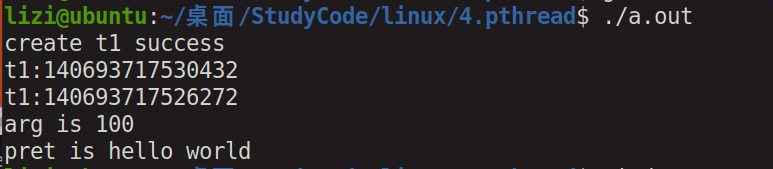

# 线程

[TOC]


## 1，概述

### 进程与线程

1，进程容纳线程

2，进程有地址空间，而线程没有

3，线程直接共享进程的地址空间


### 使用理由：

1，节俭资源


2，方便通信


## 2，线程的简单编程

### 概念：

线程：


互斥锁：


条件：


### API：


```c
#include <stdio.h>
#include <pthread.h>

//       int pthread_create(pthread_t *thread, const pthread_attr_t *attr,
//                          void *(*start_routine) (void *), void *arg);


void *tser(void *arg)
{
//	static int ret = 10;

	static char *ret = "hello world";
	
	printf("t1:%ld\n",(long unsigned)pthread_self());
	printf("arg is %d\n",*(int *)arg);

	pthread_exit((void *)ret);

}

int main()
{
	pthread_t t1;
	int p = 100;
//	int *pret = NULL;
	char *pret = NULL;

	int i = pthread_create(&t1, NULL, tser, (void *)(&p));
	
	if(i == 0){

		printf("create t1 success\n");
	}

	printf("t1:%ld\n",(long unsigned)pthread_self());
	
	pthread_join(t1,(void **)&pret);

	printf("pret is %s\n",pret);

	
	return 0;
}
```


#### 运行：





