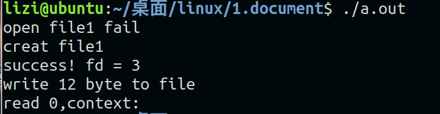
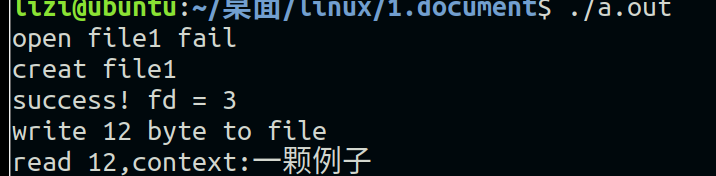
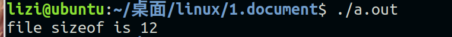
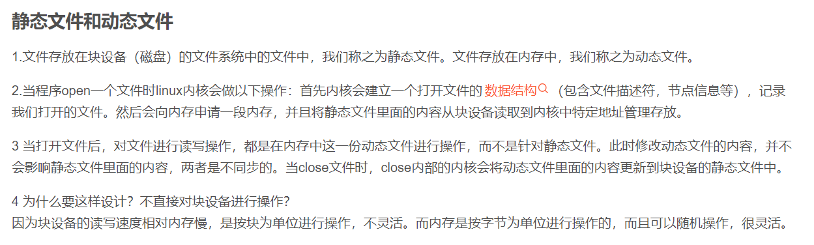

# 文件编程

[TOC]


## 1，打开/创建文件（open）

### 函数学习：

```c
#include <sys/types.h>
#include <sys/stat.h>
#include <fcntl.h>
#include <stdio.h>
int main(void)
{
        int fd;

        fd = open("./file1",O_RDWR);

        if(fd == -1){

                printf("open file1 fail\n");
                fd = open("./file1",O_RDWR|O_CREAT,0600);
                if(fd > 0){

                        printf("creat file1\n");
                }

        }
        return 0;
}
```

touch file1  //建立一个文件

rm 文件名  //删除一个文件

文件描述符：

0600 可读可写，读取4 写入2 执行1


## 2，读取/写入操作（write）

### 函数学习：

```c
#include <sys/types.h>
#include <sys/stat.h>
#include <fcntl.h>
#include <unistd.h>
#include <stdio.h>
#include <string.h>
int main(void)
{
        int fd;
        char *buf = "一颗例子";
        fd = open("./file1",O_RDWR);

        if(fd == -1){

                printf("open file1 fail\n");
                fd = open("./file1",O_RDWR|O_CREAT,0600);
                if(fd > 0){

                        printf("creat file1\n");
                }

        }

        printf("success! fd = %d\n",fd);

        write(fd,buf,strlen(buf));

        close(fd);

       	return 0;
}
```


## 3，文件的读取(read)

### 函数学习：

```c
#include <sys/types.h>  
#include <sys/stat.h>
#include <fcntl.h>
#include <unistd.h>
#include <stdio.h>
#include <string.h>
#include <stdlib.h>
int main(void)
{
	int fd;
	char *buf = "一颗例子";
	fd = open("./file1",O_RDWR);

	if(fd == -1){
		
		printf("open file1 fail\n");
		fd = open("./file1",O_RDWR|O_CREAT,0600);
		if(fd > 0){
		
			printf("creat file1\n");
		}
	
	}

	printf("success! fd = %d\n",fd);
		
	int n_write = write(fd,buf,strlen(buf));
	if(n_write != -1){
		printf("write %d byte to file\n",n_write);
	
	}
    //修改后，补充的代码
	//close(fd);
    //fd = open("./file1",O_RDWR);
    
	char *readbuf;
	readbuf = (char *)malloc(sizeof(char)*n_write + 1);
	
	int n_read = read(fd, readbuf, n_write);

	printf("read %d,context:%s\n",n_read, readbuf);

	close(fd);

	return 0;
}

```



### 问题分析：

重点在于光标位置，其实在上面代码写完之后，光标就在最后了，这个时候有两个办法，第一个就是关闭重新读取，第二个就是改变光标位置。

这是使用的是第一种方式，关闭重新读取。

#### 输出结果：




## 4，文件的光标移动（lseek）

### 函数学习：


```c
#include <sys/types.h>
#include <sys/stat.h>
#include <fcntl.h>
#include <unistd.h>
#include <stdio.h>
#include <string.h>
#include <stdlib.h>
int main(void)
{
	int fd;
	char *buf = "一颗例子";
	fd = open("./file1",O_RDWR);

	if(fd == -1){
		
		printf("open file1 fail\n");
		fd = open("./file1",O_RDWR|O_CREAT,0600);
		if(fd > 0){
		
			printf("creat file1\n");
		}
	
	}

	printf("success! fd = %d\n",fd);
		
	int n_write = write(fd,buf,strlen(buf));
	if(n_write != -1){
		printf("write %d byte to file\n",n_write);
	
	}

	char *readbuf;
	readbuf = (char *)malloc(sizeof(char)*n_write + 1);
	
	lseek(fd, 0, SEEK_SET);

	int n_read = read(fd, readbuf, n_write);

	printf("read %d,context:%s\n",n_read, readbuf);

	close(fd);

	return 0;
}

```


### 关于lseek的一个小应用：

```c
#include <sys/types.h>
#include <sys/stat.h>
#include <fcntl.h>
#include <unistd.h>
#include <stdio.h>
#include <string.h>
#include <stdlib.h>
int main(void)
{
	int fd;
	char *buf = "一颗例子";
	fd = open("./file1",O_RDWR);
	int char_sizeof = lseek(fd, 0, SEEK_END);

	printf("file sizeof is %d\n",char_sizeof);
	close(fd);

	return 0;
}
```

#### 输出结果：




## 5，前几节总结和补充

creat函数

open函数的其他操作


## 6，文件操作原理简述

### 文件描述符：

[(214条消息) Linux 文件描述符详解_Xurtle的博客-CSDN博客](https://blog.csdn.net/xlinsist/article/details/51147212?ops_request_misc=%7B%22request%5Fid%22%3A%22166592511316782248541214%22%2C%22scm%22%3A%2220140713.130102334..%22%7D&request_id=166592511316782248541214&biz_id=0&utm_medium=distribute.pc_search_result.none-task-blog-2~all~top_positive~default-1-51147212-null-null.142^v56^control_1,201^v3^control_1&utm_term=linux文件描述符&spm=1018.2226.3001.4187)

内置的 0 ，1，2分别有什么作用


### 动态文件与静态文件：




## 7，文件操作实现cp指令

### 问题分析：


### 代码：

```c
#include <sys/types.h>
#include <sys/stat.h>
#include <fcntl.h>
#include <unistd.h>
#include <stdio.h>
#include <string.h>
#include <stdlib.h>
int main(int arc,char **argv)
{
	int fdScr;
	int fdDis;

	char *readbuf = NULL;

	fdScr = open(argv[1],O_RDWR);

	int Scr_size = lseek(fdScr, 0, SEEK_END);
        lseek(fdScr, 0, SEEK_SET);
	
	readbuf = (char *)malloc(sizeof(char)*Scr_size + 8);


	int n_read = read(fdScr, readbuf, Scr_size);
	
		
	fdDis = open(argv[2],O_RDWR|O_CREAT|O_TRUNC,0600);

	write(fdDis, readbuf, strlen(readbuf));
		
	close(fdScr);
	close(fdDis);

	return 0;
}

```


## 8，文件操作实现修改文件的配置

### 问题分析：


### 代码：

```c
#include <sys/types.h>
#include <sys/stat.h>
#include <fcntl.h>
#include <unistd.h>
#include <stdio.h>
#include <string.h>
#include <stdlib.h>
int main(int argc,char **argv)
{
	int fdScr;

	char *readbuf = NULL;

	if(argc != 2){
		printf("parrarm error\n");
		exit(-1);

	}	
	fdScr = open(argv[1],O_RDWR);

	int Scr_size = lseek(fdScr, 0, SEEK_END);
        lseek(fdScr, 0, SEEK_SET);
	
	readbuf = (char *)malloc(sizeof(char)*Scr_size + 8);


	int n_read = read(fdScr, readbuf, Scr_size);
	
	char *p = strstr(readbuf,"LENG=");
	
	if(p == NULL){
		printf("NOT FIND\n");
		exit(-1);
	}			
	
	p += strlen("LENG=");
	*p = '5';

	 
        lseek(fdScr, 0, SEEK_SET);
	write(fdScr, readbuf, strlen(readbuf));
		
	close(fdScr);

	return 0;
}


```


## 9，写入文件一些变量

### 写入数字和结构体：


### 代码：

#### 整数：

```c
#include <sys/types.h>
#include <sys/stat.h>
#include <fcntl.h>
#include <unistd.h>
#include <stdio.h>

int main(void)
{

	int fd;
	int data1 = 100;
	int data2;

	fd = open("./file1",O_RDWR|O_CREAT,0600);
		
	write(fd,&data1,sizeof(int));
	
	lseek(fd,0,SEEK_SET);

	read(fd,&data2,sizeof(int));

	printf("read is %d\n",data2);	
	return 0;

}
```


#### 结构体数组：

```c
#include <sys/types.h>
#include <sys/stat.h>
#include <fcntl.h>
#include <unistd.h>
#include <stdio.h>

struct Test
{
	int len;
	char name;
};
int main(void)
{

	int fd;
	struct Test  data1[2] = {{10,'a'},{11,'b'}};
	struct Test  data2[2];

	fd = open("./file1",O_RDWR|O_CREAT,0600);
		
	write(fd,&data1,sizeof(struct Test)*2);
	
	lseek(fd,0,SEEK_SET);

	read(fd,&data2,sizeof(struct Test)*2);

	printf("read is %d,%c\n",data2[0].len,data2[0].name);	
	printf("read is %d,%c\n",data2[1].len,data2[1].name);	
	return 0;

}
```


## 10，标准IO

### linux系统的文件IO与C语言标准IO：

#### 差异：

[(214条消息) Linux中的系统IO与标准IO_不吃鱼的猫丿的博客-CSDN博客](https://blog.csdn.net/laifengyuan1/article/details/86620421?ops_request_misc=%7B%22request%5Fid%22%3A%22166592498416781432928307%22%2C%22scm%22%3A%2220140713.130102334.pc%5Fall.%22%7D&request_id=166592498416781432928307&biz_id=0&utm_medium=distribute.pc_search_result.none-task-blog-2~all~first_rank_ecpm_v1~rank_v31_ecpm-4-86620421-null-null.142^v56^control_1,201^v3^control_1&utm_term=linux系统的文件IO与标准IO&spm=1018.2226.3001.4187)


#### 标准IO：

[(214条消息) C语言的文件IO操作,非常详细!!_NSC丶warrior的博客-CSDN博客_c语言io](https://blog.csdn.net/csr_warrior/article/details/110791554?ops_request_misc=&request_id=&biz_id=102&utm_term=c语言标准io操作&utm_medium=distribute.pc_search_result.none-task-blog-2~all~sobaiduweb~default-4-110791554.142^v56^control_1,201^v3^control_1&spm=1018.2226.3001.4187)


### 代码：

#### 标准IO读取

```c
#include <stdio.h>


//FILE *fopen(const char *pathname, const char *mode);
//size_t fwrite(const void *ptr, size_t size, size_t nmemb, FILE *stream);
//size_t fread(void *ptr, size_t size, size_t nmemb, FILE *stream);

int main(void)
{
	FILE *fp;
	char *word = "Hello Wo";
	char Test[128] = {0};
	fp = fopen("./file1","w+");
			
	fwrite(word,sizeof(word),1,fp);
	fseek(fp,0,SEEK_SET);
	fread(Test,sizeof(word),1,fp);

	printf("read char is %s\n",Test);	
	fclose(fp);

	return 0;
}

```


#### 标准IO结构体

```c
#include <stdio.h>
#include <string.h>

//FILE *fopen(const char *pathname, const char *mode);
//size_t fwrite(const void *ptr, size_t size, size_t nmemb, FILE *stream);
//size_t fread(void *ptr, size_t size, size_t nmemb, FILE *stream);


struct student
{
	char *name;
	int   age;  
};

int main(void)
{
	FILE *fp;

	struct student stu1[2] = {{"li",10},{"zhang",12}};

	struct student stu2[2] = {0};

	fp = fopen("./file1","w+");
			
	fwrite(stu1,sizeof(struct student)*2,1,fp);
	fseek(fp,0,SEEK_SET);
	fread(stu2,sizeof(struct student)*2,1,fp);

	printf("name is %s,age is %d\n",stu2[0].name,stu2[0].age);
	printf("name is %s,age is %d\n",stu2[1].name,stu2[1].age);
	
	fclose(fp);
	

	return 0;
}
```


### 其他函数：

#### fputc:

#### fgetc:

#### feof:

