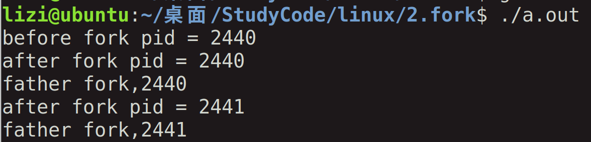
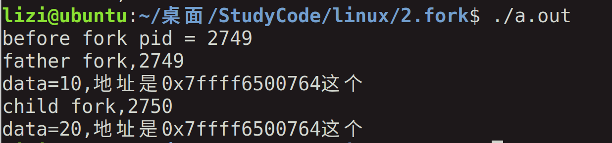

# 进程

[TOC]


## 1，进程相关概念


### ps指令：


### 全部的线程：ps -aux 

这个太多了

### 得到含有名字的：ps -aux|grep 名字


### top指令：调用任务管理器


### pid:

getpid()得到自己的进程标识符

getppid()得到父进程的标识符

```c
#include <sys/types.h>
  2 #include <unistd.h>
  3 #include <stdio.h>
  4 int main()
  5 {
  6         pid_t pida = 0;
  7 
  8         pida = getpid();
  9 
 10         printf("pid = %d\n",pida);
 11 
 12         while(1);
 13 
 14         return 0;
 15 }
 16 
```


### C语言的代码程序内存地址分布：

代码段--数据段--bss段-堆和栈


## 2,创建进程函数fork的使用

### fork函数使用：创建一个进程

其实进程创建就是相当于把之前的代码拷贝一下，然后分开执行。

拷贝之前的linux和现在的不一样，之前是全部拷贝，现在的是进行写时拷贝，子进程需要修改某个变量的时候才进行拷贝，不需要修改就是共享变量。

执行的循序是根据进程的调度。

#### 代码：

本代码是去了解进程的作用

```c
#include <sys/types.h>
#include <unistd.h>
#include <stdio.h>
int main()
{
	pid_t pida = 0;
	pid_t pidb = 0;

	pida = getpid();
	printf("before fork pid = %d\n",pida);

	pidb = fork();

	printf("after fork pid = %d\n",getpid());

	if(pidb > 0)
	{
		printf("father fork,%d\n",getpid());
	}
	else{

		printf("child fork,%d\n",getpid());
    }
	return 0;
}

```

#### 输出：




#### 代码

两个变量，不同进程的值是不一样的，这也解释了子进程进行了拷贝，然后修改。

```c
#include <sys/types.h>
#include <unistd.h>
#include <stdio.h>
int main()
{
	pid_t pida = 0;
	pid_t pidb = 0;
 	int data = 10;
	int *p = NULL;


	pida = getpid();
	printf("before fork pid = %d\n",pida);

	pidb = fork();

	if(pidb > 0)
	{
		printf("father fork,%d\n",getpid());
	}
	else{

		printf("child fork,%d\n",getpid());
		data += 10;
        }
	
 	p = &data;
	printf("data=%d,地址是%p这个\n",data,p);
	return 0;
}
```


#### 结果：




##### 问题是：

新的线程不是去拷贝data这个变量，然后进行修改，如果这样也的话，地址应该不一样吧，另外就是如果地址一样，那么相同地址的值不应该一样嘛，还是说这个要看线程。

##### 解决/答案：


