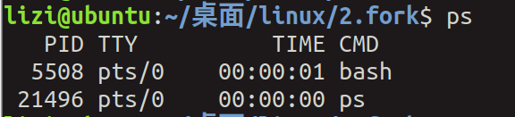
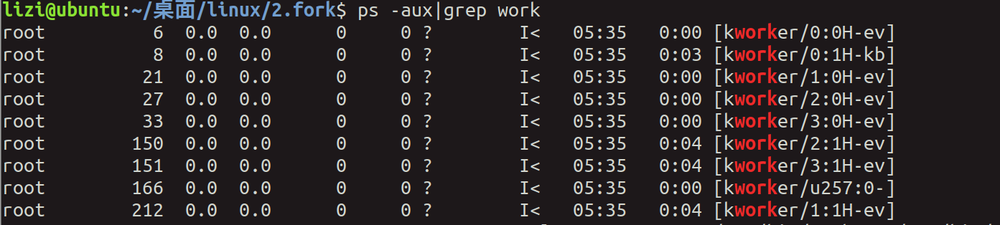
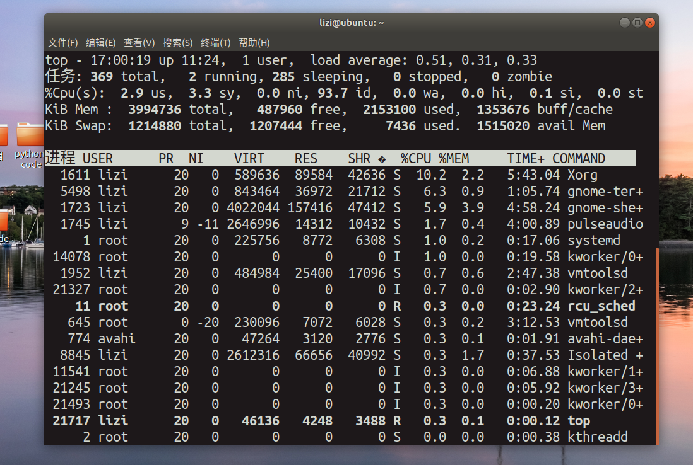
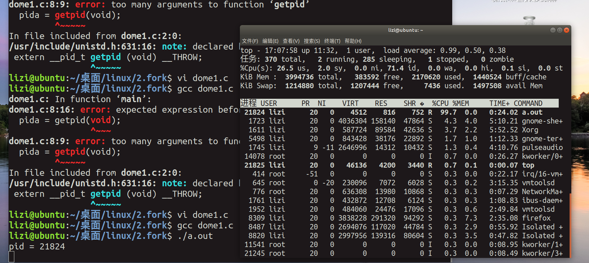

# 进程

[TOC]


## 1，进程相关概念


### ps指令：



### 全部的线程：ps -aux 

这个太多了

### 得到含有名字的：ps -aux|grep 名字



### top指令：调用任务管理器



### pid:

getpid()得到自己的进程标识符

getppid()得到父进程的标识符

```c
#include <sys/types.h>
  2 #include <unistd.h>
  3 #include <stdio.h>
  4 int main()
  5 {
  6         pid_t pida = 0;
  7 
  8         pida = getpid();
  9 
 10         printf("pid = %d\n",pida);
 11 
 12         while(1);
 13 
 14         return 0;
 15 }
 16 
```



### C语言的代码程序内存地址分布：

代码段--数据段--bss段-堆和栈


## 2,创建进程函数fork的使用

### fork函数使用：


