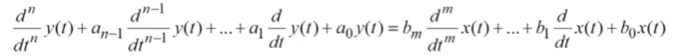

# 数值信号处理笔记

[TOC]

## 1，信号

### 为什么处理信号

- 信号是信息的承载者
- 有用信号和不需要的信号
- 提取，增强，存储和传输有用信息

### 怎么处理信号

- 模拟信号处理
- 数字信号处理

### 信号分类

- 一维信号：仅有一个自变量的信号好
- 多维信号：有两个以上自变量的信号

模拟信号（连续信号）：幅度和时间都是连续的

数字信号：幅度和时间都是离散的

### 数字信号

pass

## 2，系统

### 定义：

是指若干相互关联的事物组合而成具有特定功能的整体。

### 分类：

### 与信号系统对比

| 信号与系统             | 数字信号处理           |
| ---------------------- | ---------------------- |
| 连续时间信号时域分析   | 离散时间信号时域分析   |
| 函数傅里叶变换（频域） | 序列傅里叶变换（频域） |
| 拉普拉斯变换（复频域） | z变换（z域）           |
| 连续系统设计           | 离散系统分析与设计     |

## 时域分析

大概有这些：

- 系统的数学模型–微分方程
- 零输入相应的求解
- 单位冲激响应
- 零状态响应
- 响应模式求解
- 系统的稳定性和因果性分析

### 1，微分方程的求解方法：

法一：时域经典解法
微分方程的解分为齐次解yn(t)和特解yf(t)。y(t) = yn(t) + yn(t).
法二：零输入/零状态解法
全响应=零输入响应yzi(t) + 零状态响应yzs(t)。y(t) = yzi(t)+yzs(t).
零输入响应：输入x(t)为零，仅由初始状态产生的响应
零状态响应：初始状态为零，仅仅由输入信号x(t)产生的。
变换域求解法
用拉氏变换求解微分方程

### 2，卷积和

pass

## 频域分析

### 1，傅里叶变换

pass

### 2，Z变换

pass

